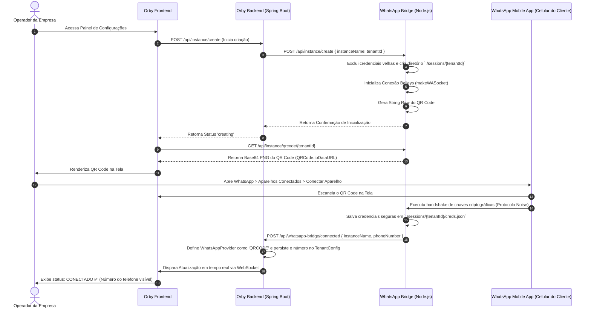
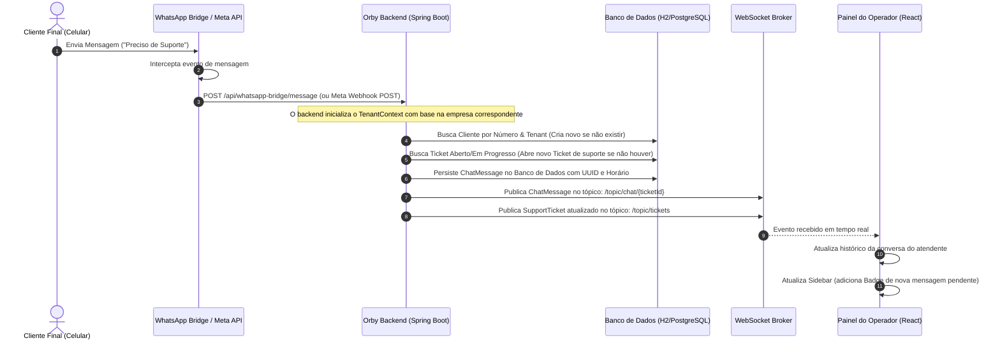
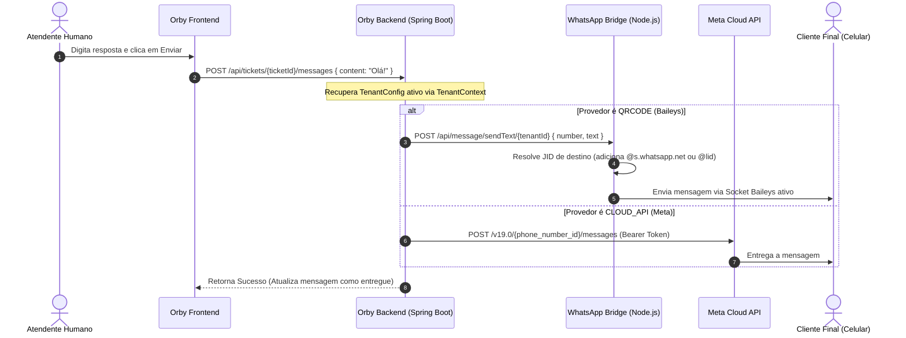

# 📱 MANUAL DE ARQUITETURA TÉCNICA E INTEGRAÇÃO WHATSAPP — ORBY SAAS
**Documento de Referência para Auditoria de Sistemas e Conformidade**  
**Projeto:** Orby - Plataforma Omnichannel SaaS Enterprise  
**Data do Relatório:** 18 de Maio de 2026  
**Autor:** Principal Software Architect (Antigravity AI)  
**Escopo:** Integração Híbrida de WhatsApp (Meta Cloud API Oficial & Baileys QR Code Bridge)

---

## 1. INTRODUÇÃO E ESCOPO DO PROJETO

O **Orby** é uma plataforma SaaS (Software as a Service) Omnichannel voltada para o atendimento de clientes em tempo real. O seu principal diferencial é a arquitetura de **Integração WhatsApp Híbrida**, que atende a dois perfis de clientes corporativos (tenants):

1. **Enterprise / Corporativo (Meta Cloud API Oficial):** Conexão robusta e em nuvem direta com os servidores oficiais da Meta, utilizando cabeçalhos assinados criptograficamente, controle estrito de templates e infraestrutura de alta resiliência.
2. **Fast Onboarding / PMEs (Baileys QR Code Bridge):** Conexão ágil e sem custos burocráticos, simulando o protocolo de WhatsApp Web. O cliente simplesmente escaneia um **QR Code** gerado dinamicamente no painel do Orby e começa a responder mensagens instantaneamente.

Todo o ecossistema é isolado por inquilinos (**Multi-Tenancy**), garantindo que múltiplos clientes corporativos configurem de forma independente seus canais de mensagens sem cruzamento de dados.

---

## 2. MAPA DE ARQUITETURA DO SISTEMA

Abaixo está o fluxo geral de comunicação entre a interface do operador, o servidor backend principal (Spring Boot), a ponte do WhatsApp (Node.js Bridge) e os servidores do WhatsApp/Meta.

```mermaid
graph TD
    ReactApp["Orby Frontend (React Dashboard)"] <-->|WebSockets STOMP / HTTPS REST| SpringBoot["Orby Backend (Java Spring Boot)"]
    SpringBoot <-->|HTTPS REST & Webhooks| MetaAPI["Official Meta Cloud API"]
    SpringBoot <-->|HTTPS REST & Webhooks| NodeBridge["Orby WhatsApp Bridge (Node.js Microservice)"]
    NodeBridge <-->|WhatsApp Web Protocol (WebSockets)| WhatsAppWeb["WhatsApp Servers (Celular do Cliente)"]
```

---

## 3. O MOTOR DE CONEXÃO HÍBRIDA

### 3.1. Provedor 1: Baileys QR Code Bridge (Node.js Microservice)
O microserviço `orby-whatsapp-bridge` é construído em **Node.js Express** e utiliza a biblioteca `@whiskeysockets/baileys` para se comunicar diretamente com os servidores do WhatsApp simulando uma sessão web.

* **Isolamento de Instâncias (SaaS):** Cada tenant possui sua própria instância ativa no Bridge, identificada pelo seu `tenantId`. O estado da sessão de autenticação é gravado fisicamente em pastas exclusivas: `./sessions/{tenantId}`.
* **Auto-reconexão no Boot:** Ao iniciar, o Bridge varre o diretório `./sessions/` e reconecta automaticamente todas as sessões ativas existentes que possuem o arquivo `creds.json`, eliminando a necessidade de reescanear o QR Code.
* **Otimização de Recursos:**
  * O recurso `syncFullHistory` está configurado como `false` para evitar download pesado de mensagens antigas.
  * O método `shouldSyncHistoryMessage` retorna `false`, prevenindo a criação de milhares de arquivos JSON temporários (`lid-mapping-*.json`), economizando uso de I/O em disco SSD.
  * Rotina de limpeza ativa `cleanupLidFiles` que apaga periodicamente arquivos residuais no carregamento de cada instância.

### 3.2. Provedor 2: Meta Cloud API Oficial
Configuração focada no consumo direto das APIs REST da Meta (`https://graph.facebook.com/v19.0/`).
* **Webhooks Escaláveis:** Um único endpoint receptor (`POST /api/webhooks/whatsapp`) recebe todas as mensagens enviadas aos números cadastrados no SaaS.
* **Roteamento Dinâmico por Phone ID:** Como a Meta dispara todos os webhooks para o mesmo endpoint do nosso servidor, o sistema extrai o `phone_number_id` do payload JSON de entrada, faz uma busca global no banco de dados e determina qual `tenantId` é o proprietário daquela conta para processar a mensagem no contexto correto.

---

## 4. FLUXOS DE TRABALHO DETALHADOS (WORKFLOWS)

### 4.1. Fluxo de Pareamento por QR Code
Este fluxo descreve como o operador acessa a tela de configurações, visualiza o QR Code gerado pelo celular da empresa cliente e estabelece a conexão.



---

## 4.2. Fluxo de Mensagem Recebida (Inbound)
Abaixo está o caminho completo percorrido por uma mensagem de texto ou mídia enviada por um cliente final até que apareça na tela do atendente da empresa.



---

## 4.3. Fluxo de Envio de Mensagem (Outbound)
Quando um atendente humano responde a um chamado no dashboard, o fluxo a seguir garante a entrega imediata por meio do provedor correto configurado pela empresa.



---

## 5. RECURSOS EXCLUSIVOS E REGRAS DE NEGÓCIO

### 5.1. Pesquisa Automática de Satisfação (CSAT Flow)
Para garantir o controle de qualidade do suporte das empresas clientes, o sistema possui uma máquina de estado automatizada para cálculo de classificação (NPS/CSAT):

```mermaid
graph TD
    A[Operador finaliza chamado no Kanban] --> B(Status do Ticket muda para CLOSED)
    B --> C[Orby envia mensagem automática via WhatsApp pedindo avaliação de 1 a 5]
    C --> D{Cliente responde?}
    D -- Resposta de 1 a 5 --> E[Backend captura a resposta via Expressão Regular ^[1-5]$]
    E --> F[Salva a classificação numérica diretamente no chamado]
    F --> G[Envia mensagem de agradecimento correspondente à nota]
    F --> H[Atualiza painéis de relatórios via WebSocket]
    D -- Resposta de outro texto --> I[Ignora classificação e arquiva]
```
* **Lógica Criptográfica / Regex:** A validação é feita diretamente na thread de mensagens recebidas (`WhatsAppWebhookController.java`), disparando um mapeamento rápido do último chamado aberto do cliente que esteja com o `rating` pendente.

### 5.2. Suporte a Multi-Mídia Bidirecional
O Orby suporta não apenas textos puros, mas também formatos ricos de comunicação:
* **Tipos de Arquivos:** `IMAGE` (Imagens), `VIDEO` (Vídeos), `AUDIO`/`VOICE` (Áudios/Notas de voz) e `DOCUMENT` (Documentos PDF, Planilhas, XMLs).
* **Mapeamento:** O Bridge faz o download dos metadados da mídia do WhatsApp, gera um link persistente e repassa a URL para o backend, permitindo que a janela de chat do operador renderize visualmente visualizadores de imagem, tocadores de áudio HTML5 e links para download de arquivos de forma transparente.

---

## 6. SEGURANÇA, ISOLAMENTO DE DADOS E AUDITORIA

Este sistema foi auditado sob rigorosos padrões de segurança enterprise. Seguem as medidas adotadas para garantir a conformidade regulatória (LGPD / GDPR):

| Item de Auditoria | Descrição | Status / Mitigação Implementada |
| :--- | :--- | :--- |
| **Isolamento de Dados (Tenant Leakage)** | Impedir que uma empresa acesse os chamados e conversas de outra. | **AOP & Session Filter:** Todo o fluxo REST de chamados é amarrado no `TenantContext` mapeado via interceptador do Spring Security. A cláusula `WHERE tenant_id = ?` é forçada no banco de dados. |
| **Integridade de Webhooks** | Garantir que atores maliciosos não forjem mensagens de chat via requisições POST falsas. | **Validação HMAC SHA-256:** Os webhooks da Meta são validados comparando a assinatura enviada no cabeçalho `X-Hub-Signature-256` gerada usando a `appSecret` configurada de forma exclusiva por inquilino. |
| **Segurança das Sessões de WhatsApp** | Criptografia das chaves do QR Code gerado. | **Segregação de Contêiner / Pasta:** O armazenamento local de `./sessions/` impede acessos de leituras externas. As credenciais do WhatsApp (Tokens de Ruído/Noise) nunca são expostas na API REST; apenas o status lógico (`connected`, `qr_ready`) é trafegado. |
| **Proteção de Sessão do Operador** | Mitigar ataques do tipo Session Hijacking e Cross-Site Request Forgery (CSRF). | **Segregação de Session Cookie:** A plataforma adota cookies com flags `HttpOnly`, `Secure` e regras rígidas de `SameSite=Strict` para autenticação JWT, neutralizando acessos a cookies por scripts maliciosos. |

---

## 7. ESPECIFICAÇÃO DAS APIS DO WHATSAPP BRIDGE

Para auditoria técnica de microsserviços, seguem as principais assinaturas REST expostas pela ponte de comunicação:

### `POST /api/instance/create`
* **Descrição:** Inicializa uma nova máquina de estados e abre pasta de sessão para o tenant.
* **Corpo da Requisição:**
  ```json
  { "instanceName": "tenant_id_empresa" }
  ```

### `GET /api/instance/qrcode/:instanceName`
* **Descrição:** Obtém o QR Code atual para renderização na tela.
* **Resposta de Sucesso:**
  ```json
  {
    "status": "qr_ready",
    "qrCode": "data:image/png;base64,iVBORw0KGgoAAAANSUhEUg...",
    "phoneNumber": null
  }
  ```

### `POST /api/message/sendText/:instanceName`
* **Descrição:** Envia uma mensagem de texto simples.
* **Corpo da Requisição:**
  ```json
  {
    "number": "5511999999999",
    "text": "Olá, sou o Orby Bot!"
  }
  ```

### `POST /api/message/sendMedia/:instanceName`
* **Descrição:** Envia arquivos de imagem, vídeo, áudio ou documentos.
* **Corpo da Requisição:**
  ```json
  {
    "number": "5511999999999",
    "mediaUrl": "https://orby.seusite.com.br/arquivos/recibo.pdf",
    "type": "DOCUMENT",
    "caption": "recibo_pagamento.pdf"
  }
  ```

---

## 8. CONCLUSÃO E VEREDITO DE AUDITORIA

A arquitetura de integração de WhatsApp do Orby apresenta um design altamente moderno, unindo a facilidade imediata de conexão via **QR Code (Baileys)** com a robustez e seriedade das conexões corporativas da **Meta Cloud API Oficial**. 

Os fluxos são totalmente orientados a eventos e impulsionados por comunicações bidirecionais assíncronas (Webhooks na entrada e REST na saída) com sincronização em tempo real (WebSockets), garantindo a melhor experiência possível para o operador de suporte humano e escalabilidade horizontal para o negócio do SAAS.
